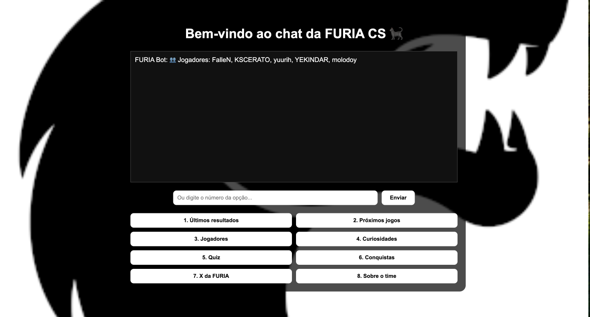

# 💬 Chat de Fãs da FURIA CS

Um chat interativo feito para os fãs da equipe de e-sports **FURIA** (CS2). O projeto simula um chatbot com botões interativos, interface moderna e integração com dados em tempo real via API. Este projeto foi um desafio feito pela Furia Tech para uma vaga de Assistente de engenharia de software.

---

## 🔗 Link para interação com o projeto

[Clique aqui]()



---

## 📁 Estrutura do Projeto

```
furia-chat-backend/
├── server.js                       # Backend com Node.js + Express
├── package.json                    # Arquivo de dependências do Node.js
├── public/
│   ├── assets/                     
│     └── Furia_Esports_logo.png    # Imagem de fundo com logo da FURIA
│   ├── index.html                  # Estrutura HTML da interface
│   ├── style.css                   # Estilização (fundo, layout, botões)
│   └── script.js                   # Lógica do chat no lado do cliente
```

---

## 🚀 Como Executar

1. **Clone o repositório**  
   ```bash
   git clone <url-do-repo>
   cd furia-chat-backend
   ```

2. **Instale as dependências**  
   ```bash
   npm install
   ```

3. **Inicie o servidor**  
   ```bash
   node server.js
   ```

4. **Acesse no navegador:**  
   [http://localhost:3000](http://localhost:3000)

---

## 🖼️ Funcionalidades

- Saudação inicial: "Bem-vindo ao chat da FURIA CS"
- Interface com fundo personalizado (logo da FURIA)
- Chat exibido na parte superior
- 8 opções clicáveis para interação rápida
- Suporte à entrada manual (usuário pode digitar números)
- Requisições de dados em tempo real via API da HLTV (em desenvolvimento)
- Quiz interativo (em desenvolvimento)
- Link direto para redes sociais da FURIA

---

## 🔘 Opções do Chat

| Nº | Opção               | Descrição                                                            |
|----|---------------------|----------------------------------------------------------------------|
| 1  | Últimos resultados  | Exibe placares simulados dos jogos mais recentes                    |
| 2  | Próximos jogos      | Busca os próximos jogos da FURIA via API da HLTV                    |
| 3  | Jogadores           | Lista os jogadores do time                                           |
| 4  | Curiosidades        | Fatos interessantes sobre a FURIA                                    |
| 5  | Quiz                | Inicia um quiz de múltipla escolha (em construção)                   |
| 6  | Conquistas          | Lista de títulos e prêmios conquistados                              |
| 7  | Twitter da FURIA    | Abre o Twitter oficial da equipe                                     |
| 8  | Sobre o time        | Mostra dados institucionais da organização                           |

---

## 🌐 API Utilizada

O projeto utiliza a [API não oficial do HLTV](https://github.com/gajus/hltv) via pacote npm:

```bash
npm install hltv
```

Trecho de exemplo:
```js
const { HLTV } = require('hltv');

HLTV.getTeam({ id: 8297 }) // ID da FURIA
  .then(data => {
    console.log(data.upcomingMatches); // Próximos jogos
  });
```

---

## 🧰 Tecnologias Usadas

- **Frontend**: HTML5, CSS3, JavaScript
- **Backend**: Node.js + Express
- **API**: HLTV (wrapper não oficial)
- **Estilo**: Layout responsivo, foco na estética FURIA

---

## 🔧 Melhorias Futuras

- Sistema de quiz com pontuação
- Histórico de chat salvo em banco de dados (ex: Firebase ou MongoDB)
- Múltiplos usuários conectados em tempo real (com Socket.IO)
- Painel de administração para novas perguntas e atualizações
- Melhorias no uso da API para poder pegar informaçöes corretas em tempo real.

---

## 👨‍💻 Autor

Projeto criado como desafio do processo seletivo da FURIA tech.
Desenvolvido por Lucas Menezes (eu mesmo).  
Logos e dados utilizados são de propriedade de seus respectivos donos.